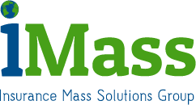

#API de Validación Imass

###Requisitos

Antes de empezar es necesario solicitar un token al área de sistemas.

###Validación Inicial
Antes de comenzar a realizar peticiones se recomienda realizar una prueba de conectividad con la API.

```shell
curl http://imasscotiza.com:3000/
```


```json
{"version":"v1.0.0","system":"SISNOVA"}
```